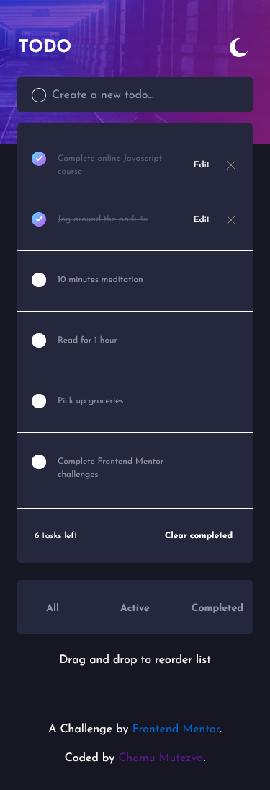
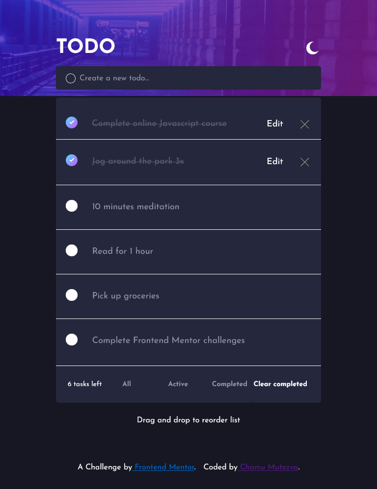

# Frontend Mentor - Todo app solution

This is a solution to the [Todo app challenge on Frontend Mentor](https://www.frontendmentor.io/challenges/todo-app-Su1_KokOW). Frontend Mentor challenges help you improve your coding skills by building realistic projects. 

## Table of contents

- [Overview](#overview)
  - [The challenge](#the-challenge)
  - [Screenshot](#screenshot)
  - [Links](#links)
- [My process](#my-process)
  - [Built with](#built-with)
  - [What I learned](#what-i-learned)
  - [Continued development](#continued-development)
  - [Useful resources](#useful-resources)
- [Author](#author)
- [Acknowledgments](#acknowledgments)


## Overview

### The challenge

Users should be able to:

- View the optimal layout for the app depending on their device's screen size
- See hover states for all interactive elements on the page
- Add new todos to the list
- Mark todos as complete
- Delete todos from the list
- Filter by all/active/complete todos
- Clear all completed todos
- Toggle light and dark mode
- **Bonus**: Drag and drop to reorder items on the list

### Screenshot





### Links

- Solution URL: [Frontend link]()
- Live Site URL: [Todo app](https://todo-app-frontend-mentor-challenge.netlify.app/)

## My process

### Built with

- Semantic HTML5 markup
- CSS custom properties
- Sass
- Flexbox
- CSS Grid
- Mobile-first workflow
- [React](https://reactjs.org/) - JS library
- [react-beautiful-dnd](https://www.npmjs.com/package/react-beautiful-dnd)
- React Context api

### What I learned

This was my first time using the `drag and drop` feature. I used the `react beautify dnd` , with the help of the following notes and video from freeCodeCamp. [How to Add Drag and Drop in React with React Beautiful DnD](https://www.freecodecamp.org/news/how-to-add-drag-and-drop-in-react-with-react-beautiful-dnd/)
Here are a brief notes on the installation and implementation

1. install `react-beautiful-dnd`  using npm `npm i react-beautiful-dnd`
2. import the modules to use at the top of the file that needs the drag and drop feature `import { DragDropContext, Droppable } from 'react-beautiful-dnd';`
3. Here is a code snippet of where i used it from the `Main.js` file:
```js
     <DragDropContext onDragEnd={handleOnDragEnd}>
        <Droppable droppableId='tasks'>
          {(provided) => (
            <ul className='todo-list'
              {...provided.droppableProps}
              ref={provided.innerRef}>
              {taskList}
              {provided.placeholder}
            </ul>
          )}
          </Droppable>
      </DragDropContext>          

```
4. `taskList` is an array of the todos, which is in another file, the `Todo.js` file. The `Draggable`  library has to be imported as follows `import { Draggable } from 'react-beautiful-dnd';`. 

```js
<Draggable key={props.id} draggableId={props.id} index={props.index}>
            {(provided) => (
                <li className='todo'
                    {...provided.draggableProps}
                    {...provided.dragHandleProps}
                    ref={provided.innerRef} >
                    {isEditing ? editingTemplate : viewTemplate}
                </li>
            )}
   </Draggable>

```
5.  Back to the Main.js file, the following function must be added to wire the drag and drop feature

```js
function handleOnDragEnd(result) {
        if (!result.destination) return
        const items = Array.from(tasks)      
        const [reorderedItems] = items.splice(result.source.index, 1)
        items.splice(result.destination.index, 0, reorderedItems)       
        setTasks(items)
  }
```

### Continued development

- to improve the site to be a Fullstack application. The data is pulled using Mongodb Realm. Users should be able to edit and delete the todos to be served in the Mongodb database. Currently all the  read and write operations are lost upon refreshing as the changes are not being served to the database.

### Useful resources

- [How to Add Drag and Drop in React with React Beautiful DnD](https://www.freecodecamp.org/news/how-to-add-drag-and-drop-in-react-with-react-beautiful-dnd/) to implement the drag and drop

## Author

- Website - [Chamu Mutezva](https://github.com/ChamuMutezva)
- Frontend Mentor - [@ChamuMutezva](https://www.frontendmentor.io/profile/ChamuMutezva)
- Twitter - [@ChamuMutezva](https://twitter.com/ChamuMutezva)

## Acknowledgments

- [Frontend Mentor](https://www.frontendmentor.io/home) for a great job they are doing by providing awesome challenges and a platform where you can get help and feedback.